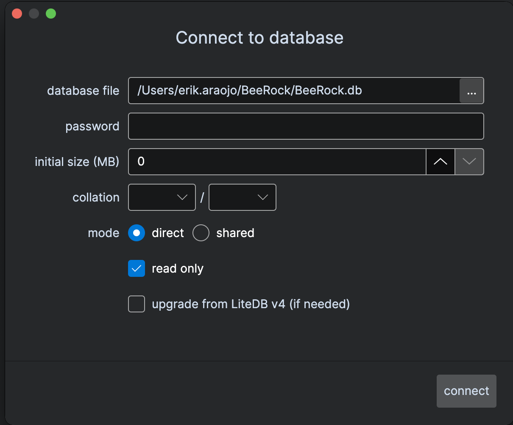

# OneBella

A modern cross-platform (Windows, MacOS and Linux) GUI tool for viewing and editing LiteDB 5+ databases

## Quickstart Guide

1. Select a database file. Click Connect

2. Click the run button (top menu) or Press F5 to run the SQL query

   To open a new tab : `Right click table` --> `open new tab`
   
   To toggle db connection : `Right click the DB` --> select `connect` or `disconnect`
